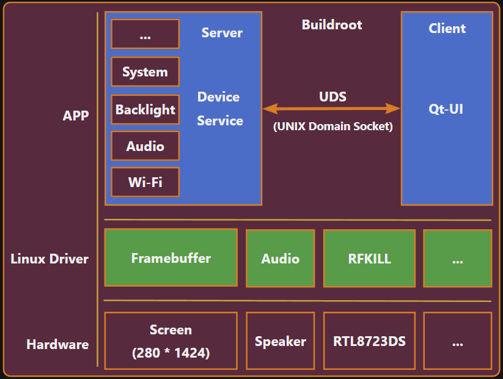

# 项目基本信息
* 项目名称：云雀桌面股票看台
* 项目编号：20250112-YQ-TICKER-001
* 项目负责人：林政硕
* 所属部门/团队：/
* 立项日期：2025-11-26
* 预计开始日期：2025-12-01
* 预计结束日期：2025-02-01

# 项目背景与立项原因
随着个人投资和家庭理财需求的提升，用户对“随手可见的行情数据”需求逐渐增强。虽然手机 App 可以查看股票行情，但频繁解锁/打开 App 并不方便，尤其在办公或桌面场景下。
为此，本项目计划基于全志 T113 平台 + 长条屏显示器，打造一个桌面型的“股票行情看台”（桌面电子摆件），让用户随时查看关注股票的实时行情、涨跌幅信息，兼具装饰与数据展示功能。
该产品具有开发成本低、UI 灵活、可扩展性强等优势，适合作为创意产品、小型硬件产品或桌面外设推向市场。

# 项目范围
1. 本项目包含的工作
* 基于 T113 的硬件设计
* 软件系统开发（外设适配、系统适配、应用开发）
* UI 设计
* 外观结构设计
* 测试、调优
2. 本项目不包含的工作
* 手机 App 开发
* 云服务
* 高精度行情（如 Level-2）
* 大规模商业量产成本优化

# 技术方案
1. 平台与操作系统
* 芯片：Allwinner T113
* 系统：Buildroot 方案
* 存储介质：SPI NAND
2. UI 技术方案
* Qt 5.15.2
3. 网络方案
* Wi-Fi 连接
4. 数据接口方案
* 略
5. 稳定性方案
* 程序监控
* 自动重启 / 看门狗

# 项目框架图
